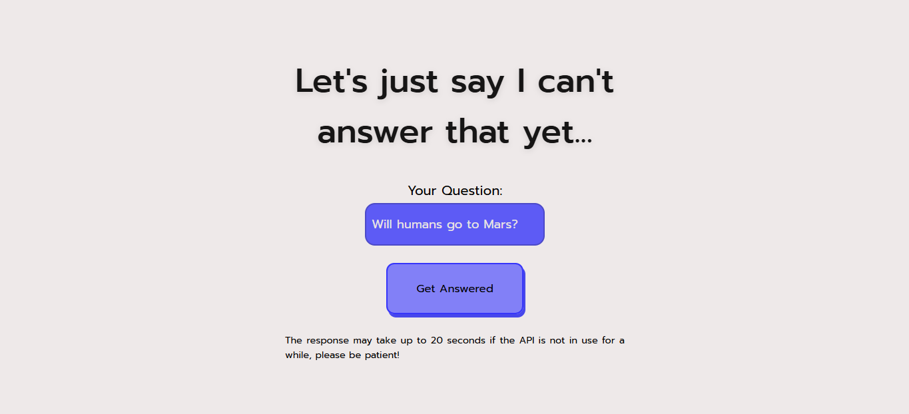

# Uncertain Decisions

Welcome to the website where your questions will be answered! Here, everything is based on a question with a yes/no answer, and you will receive the answer!

## How does it work?

1. You type your question in the input field
2. Then, click the "Get Answered" button (the response may take up to 20s if the API is not used for a while)
3. Just look at the answer!

## How does the API work?

The API was developed in Python, you can find it in `backend/main.py` and it's avaiable for use at: `https://decisions-api-v1.onrender.com/get-random-answer`, also, I published it using Render

## Why did I create this?

I created this funny website so that anyone can ask a question and receive a random answer, wich, who knows, might even turn out to be true!